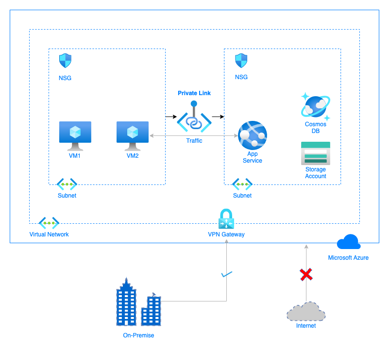

# #azure-solutions-architect zabezpieczenie komunikacji pomiedzy on-prem a Azure

Date: 2020-10-22

[Add to calendar](https://evt.mx/nLArx0BI)

[Meeting link](https://teams.microsoft.com/l/meetup-join/19%3ameeting_MGYzOTZjYWYtNDliNi00NzJiLWFkNWEtYjRhMzJhMGFiMzcw%40thread.v2/0?context=%7b%22Tid%22%3a%22ef60a5a4-900c-4789-89cd-0c42f28ef541%22%2c%22Oid%22%3a%22843f36ea-2af5-4be3-a168-6b8fd3acd1b3%22%7d)

[Recording](#)

# Agenda

1. Review przygotowanych rozwiązań.
2. Q&A.

# Discussion

## Review projektu architektury

### Zadanie
Firma chce zabezpieczyć komunikację sieciową pomiędzy zasobami, które są hostowane na Azure oraz zasobami postawionymi na on-premie. Cała infrastruktura powinna być dostępna tylko z sieci firmowej, oraz w ramach podsieci dla maszyn wirtualnych. W chwili obecnej podjęta została decyzja o przeniesieniu całych maszyn wirtualnych wraz z zasobami natomiast zaproponowane rozwiązanie powinno uwzględnić możliwość użycia różnych zasobów Azure w przyszłości.

### Wymagania:
dwie wersje systemu: 
- 1) stosunkowo bezpieczna i tania oraz 
- 2) droższa ale bardziej zabezpieczona
- należy policzyć koszty rozwiązania (bez kosztów maszyn wirtualnych)
istotna jest analiza wdrożenia innych usług hostowanych na Azure w przyszłości
- nakład pracy potrzebny do wdrożenia obu rozwiązań
- sposób monitorowania / zarządzania rozwiązaniami
- analiza SLA

### Poglądowy schemat architektury:
#### Private link

#### Service endpoints

## Q&A
- miesięczny koszt rozwiązania opartego o Private Link to ok. $9. Przy załozeniu transferu inbound/outbound na poziomie 100GB, oraz wykorzystaniu jednego "link" dla usług!!!