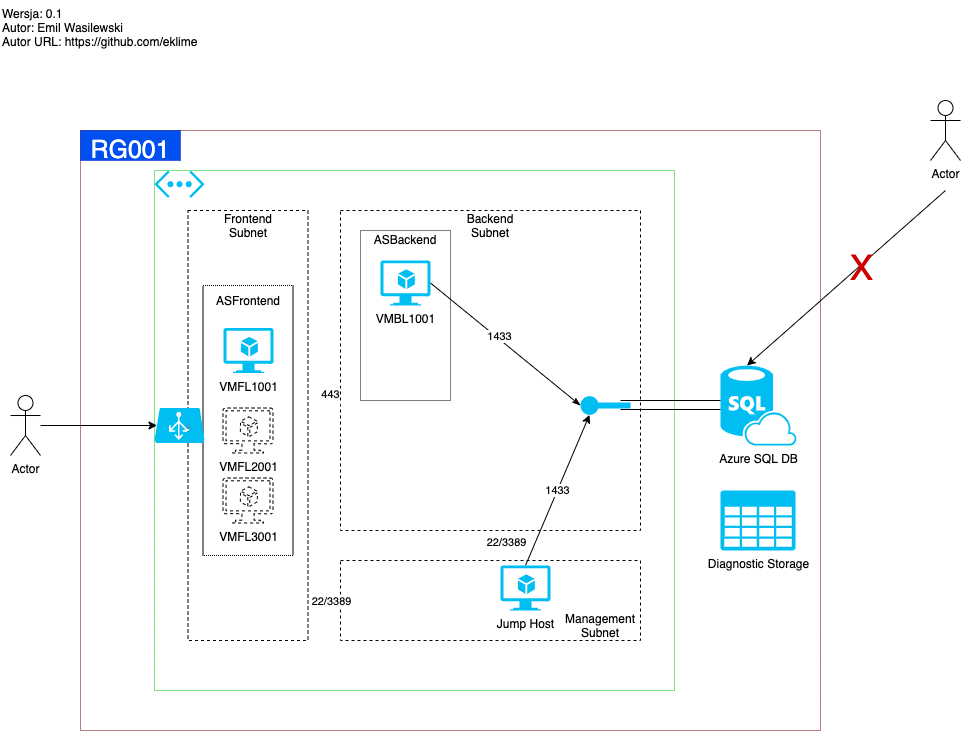

-- Wersja 0.1 by [@eklime](https://github.com/eklime)

# 1. Opis rozwiązania 
Rozwiązanie opierać się ma o klasyczny model aplikacji trójwarstwowej zawierające warstwę dostępową, obliczeniową oraz bazodanową. 
Warstwa dostępowa oraz obliczeniowa będzie oparta o maszyny wirtualne z systemem Windows Server 2019 lub Ubuntu Linux. 
Bazy danych opierać się będą o Azure SQL. Maszyny warstwy dostępowej muszą być dostępne pod publicznym, stałym adresem IP. 
Dostęp do warstwy obliczeniowej ma być możliwy jedynie z warstwy dostępowej po porcie 443 lub z "jump hosta" wewnątrz sieci prywatnej przy wykorzystaniu RDP lub SSH w zależności od systemu operacyjnego. 
Dostęp do baz danych ma być możliwy tylko z poziomu warstwy obliczeniowej i w/w "jump hosta". 

# 2. Założenia techniczne 
1. Wszystkie zasoby muszą być wdrożone w obrębie jednego regionu geograficznego 
2. Maszyny wirtualne pracują w tej samej sieci prywatnej jednak w dwóch różnych podsieciach 
3. Maszyny z tej samej "grupy" pracują w ramach Availability Sets 
4. Jump Host pracuje w odseparowanej podsieci tej samej sieci wirtualnej 
5. Baza danych nie jest dostępna przez sieć Internet, a jedynie poprzez dedykowany adres IP w sieci prywatnej z podsieci 'Backend' i 'Managemnt'. 
6. Przestrzeń adresowa vNET: 10.10.0.0/23 
   1. 'Frontend' subnet: 10.10.1.0/24 
   2. 'Backend' subnet: 10.10.2.0/27 
   3. 'Management' subnet: 10.10.2.32/27 
7. Całość rozwiązania musi pozwalać na powielanie identycznej infrastruktury różniącej się jedynie prefixem (lub sufixem) w nazwie zasobów podawanym podczas wdrożenia np.: 
   1.  RG001 - suffix '001' 
       1.  VMFL1001 - VMFL1 to Virtual Machine Frontend Linux 1 
       2.  VMFL2001 - VMFL2 to Virtual Machine Frontend Linux 2 
       3.  VMBW1001 - VMBW1 to Virtual Machine Backend Windows 1 
   2.  RG002 - suffix '002' 

# 3. Wymagania ***'bez tego ani rusz'*** 
1. Jedna maszyna w podsieci dostępowej z publicznym, stałym adresem IP dostępna "ze świata" po porcie 443 i 3389/22 w zależności od OS pracująca w ramach ASFrontend 
2. Jedna maszyna w warstwie obliczeniowej bez publicznego adresu IP pracująca w ramach ASBackend dostępna po portach 443, 3389/22 w zależności od OS 
3. Baza danych Azure SQL dostępna dla zasobów w Azure 

# 4. Wymagania ***'fajnie mieć'*** 
1. Maszyna Jump host z Windows Server 2019 i publicznym adresem IP dostępna po RDP w sieci 'Backend' 
2. Azure SQL ukryty za Private Endpoint z NSG "wpuszczającym" port 1433 z podsieci 'Backend' i 'Management'

# 5. Wymagania ***'jesteśmy gotowi na więcej'*** 
1. Publiczny load balancer przed warstwą dostępową (basic/standard bez znaczenia)
